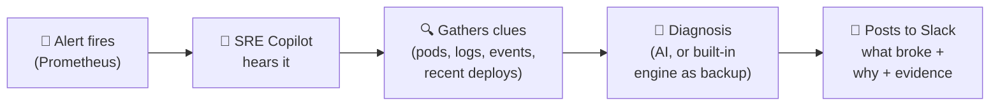

# SRE Copilot 🤖🚨

**An AI on-call assistant for Kubernetes.** When something breaks at 2 AM, it
figures out what happened and tells your team in Slack — in seconds, with the
evidence attached.

## Why this exists

When a production system has a problem, the on-call engineer gets paged and then
spends precious minutes doing detective work: *which service? which pod? what
changed? what do the logs say?* Every minute of that is downtime.

SRE Copilot does the detective work automatically. It hears the alert, gathers
the clues from Kubernetes, forms a diagnosis, and posts the whole story to Slack
— so the human starts from "here's what's wrong" instead of a blank screen.



## What it does, step by step

1. **Listens** — Prometheus/Alertmanager sends it a webhook the moment an alert fires.
2. **Investigates** — it queries the live Kubernetes cluster: are pods crashing?
   Restarting? Any recent deployments? What do the logs say?
3. **Diagnoses** — an AI model writes up a likely cause and fix. No AI key? A
   built-in heuristic engine does the job instead, so it *never* depends on an
   external service during an incident.
4. **Reports** — the full picture lands in Slack: what broke, why it thinks so,
   and the evidence.

## Proven, not promised

Measured against a live Kubernetes cluster:

- ✅ **15/15** test alerts triaged — zero missed, zero failed
- ⚡ **~28ms** median triage time (heuristic path)
- 🔁 Fully reproducible: ships as a Helm chart, Terraform for AKS, Argo CD for
  GitOps delivery, CI on GitHub Actions

<details>
<summary><b>🛠️ For engineers — architecture & quickstart</b></summary>

### How it works (technical)

```
Prometheus ──▶ Alertmanager ──▶ SRE Copilot ──▶ Slack
                                │  /alerts
                                ├─ 1. Parse alert (alertname, severity, namespace, workload)
                                ├─ 2. Enrich from the Kubernetes API:
                                │     pods, restarts, events, container logs, deployment status
                                ├─ 3. Diagnose:
                                │     LLM (any OpenAI-compatible API) ──or── heuristic fallback
                                └─ 4. Notify: structured Slack message + JSON log
```

Set `LLM_API_KEY` and it upgrades to LLM-generated diagnoses automatically.
Without it, the deterministic heuristic engine runs the full pipeline.

### Quickstart (local demo, no cluster needed)

```bash
python -m venv .venv && source .venv/bin/activate
pip install -r requirements.txt

# terminal 1 — run the service (enrichment degrades gracefully without a cluster)
uvicorn app.main:app --port 8080

# terminal 2 — fire a sample Alertmanager webhook
python demo/send-test-alert.py
```

See [DEMO.md](DEMO.md) for the full Kubernetes demo on `kind`, including a live
CrashLoopBackOff scenario.

### Configuration

| Variable | Default | Description |
|---|---|---|
| `PORT` | `8080` | HTTP port |
| `API_KEY` | _(empty = auth off)_ | Shared secret; when set, `/alerts` requires `X-API-Key` or `Authorization: Bearer` |
| `K8S_DEFAULT_NAMESPACE` | `default` | Namespace used when the alert has none |
| `K8S_LOG_TAIL_LINES` | `50` | Log lines fetched per troubled pod |
| `LLM_BASE_URL` | `https://api.openai.com/v1` | Any OpenAI-compatible endpoint (OpenAI, Azure OpenAI, Ollama, vLLM) |
| `LLM_MODEL` | `gpt-4o-mini` | Model name for diagnosis |
| `LLM_API_KEY` | _(empty = heuristic mode)_ | Enables LLM diagnosis when set |
| `SLACK_WEBHOOK_URL` | _(empty = log only)_ | Incoming Slack webhook for notifications |
| `LOG_LEVEL` | `INFO` | Python log level |

### Repository layout

```
app/                  FastAPI service (receiver, enricher, LLM, notifier)
helm/sre-copilot/     Helm chart (deployment, RBAC, config, secret)
prometheus/           Example alert rules + Alertmanager routing to the copilot
terraform/            AKS cluster (resource group, VNet, node pool)
gitops/               Argo CD Application manifest
.github/workflows/    CI: lint, test, build/push image, helm lint, terraform validate
demo/                 Sample Alertmanager payload + sender script
```

### Design notes

- **Enrichment never fails the request.** Every Kubernetes lookup is defensive; partial
  context with a recorded error beats a 500 during an incident.
- **Runs as non-root**, with liveness/readiness probes and least-privilege RBAC
  (read-only on pods, logs, events, workloads).
- **Resolved alerts are acknowledged and skipped** — no noise for recoveries.
- LLM output is requested as strict JSON and validated before use; any LLM failure
  falls back to heuristics so paging never depends on an API.

### Roadmap

- Vector-store lookup of past incidents for "have we seen this before?" context
- Auto-generated runbook PRs from repeated diagnoses
- MS Teams / PagerDuty notifiers next to Slack

</details>

---
Built by [Shrikar Kaduluri](https://github.com/Parker2127) — DevOps Engineer.
